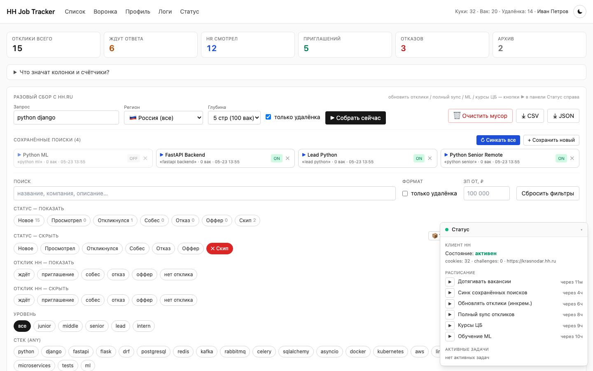
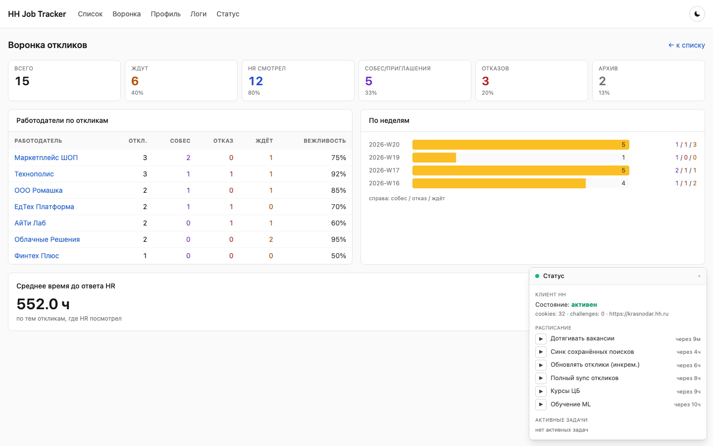
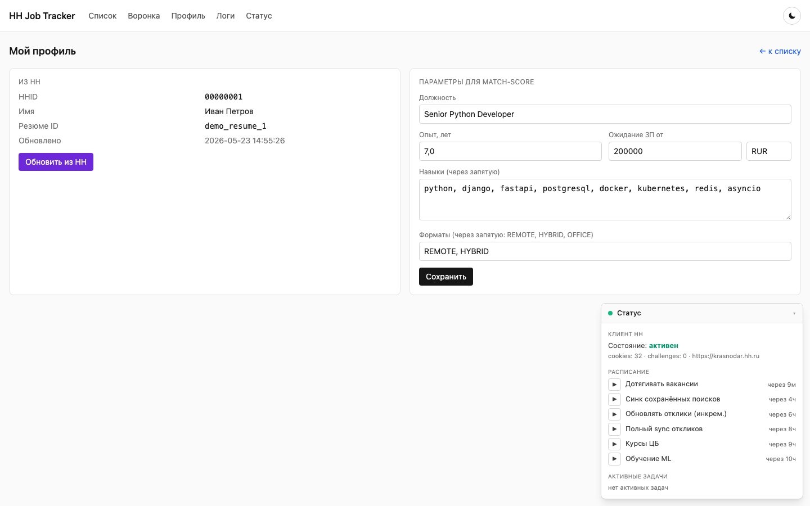
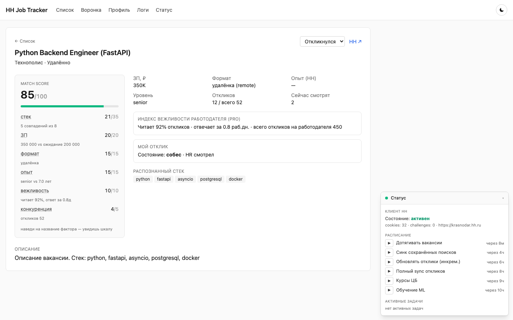
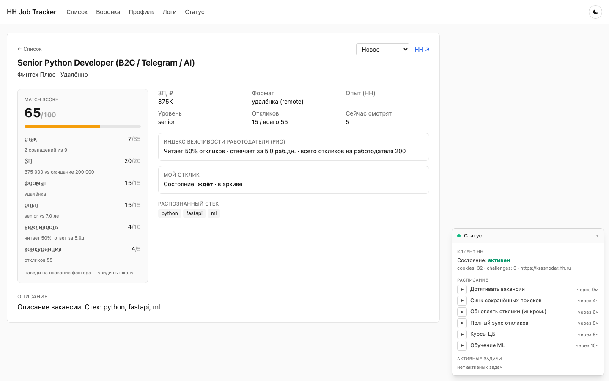
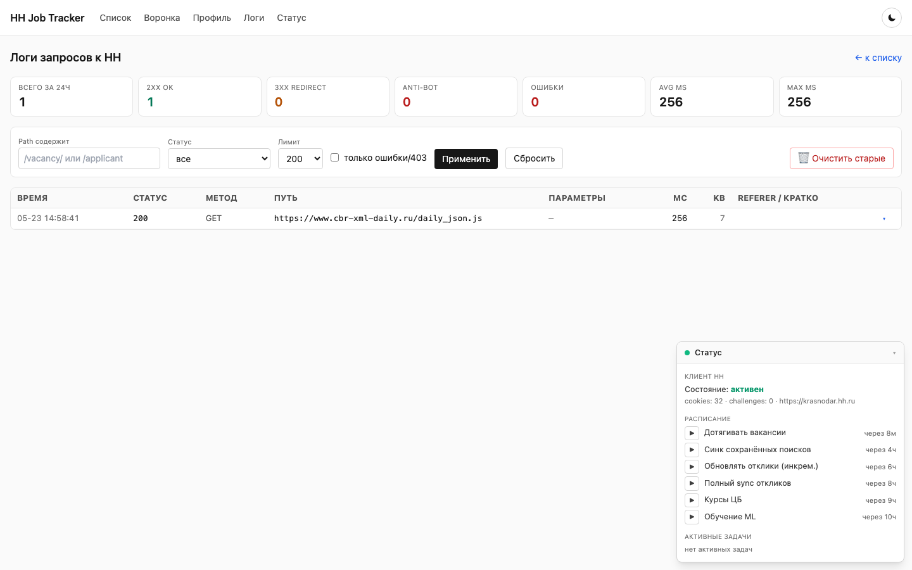

# HH Job Tracker

Локальное self-hosted приложение для упорядочивания личного поиска работы на **hh.ru**.

Тянет вакансии и личные данные (отклики, резюме, индекс вежливости работодателей) через парсинг страниц hh.ru под сессионной кукой залогиненного браузера, агрегирует в SQLite и отдаёт через FastAPI + Jinja2 + HTMX. Считает match-score, предсказывает вероятность приглашения, ведёт воронку откликов.

## Скриншоты

> Все скриншоты сняты на **demo-режиме** (`make demo-seed && make demo-run`) — данные вымышленные, реальная БД в публикацию не попадает.

| Главная — таблица + воронка + фильтры | Воронка откликов |
|---|---|
|  |  |

| Профиль (импорт из резюме) | Деталка вакансии: разбивка match-score |
|---|---|
|  |  |

| Архивная вакансия | Лог HTTP-запросов к HH |
|---|---|
|  |  |

## Почему именно HH Job Tracker

**Проблема.** Активный поиск работы на hh.ru — это сотни вкладок, неотсортированный inbox откликов, забытые приглашения, выбор между «100 хороших» и «1000 шумных». UI hh.ru заточен под массового соискателя, а не под того, кто целенаправленно ищет роль с конкретным стеком, ЗП и форматом.

**Идея.** Один локальный инструмент, который:
- **видит твою воронку** — все отклики с реальными состояниями (RESPONSE/INVITATION/INTERVIEW/DISCARD), а не «непрочитанные»
- **ранжирует вакансии под тебя** — match-score 0–100 на базе твоего же импортированного резюме, не общая «релевантность» от HH
- **предсказывает шанс приглашения** — predict % через эвристику, дальше — sklearn LogisticRegression на твоей реальной истории
- **знает работодателя** — индекс вежливости HH Pro (% прочитанных откликов, среднее время ответа) встроен в скоринг
- **держит дисциплину** — фоновый sync каждые 4–6 часов, дедуп, авто-архив, история смены статусов

**Почему «Tracker», а не «Scraper».** Скрейпинг тут — побочный механизм доступа к собственным данным после закрытия OAuth-API (15.12.2025). Главное — трекинг: воронка, статусы, скоринг, predict. Поэтому одна сессия = один пользователь, никаких массовых прогонов, никакого распространения данных.

**Почему self-hosted.** Сессионная кука HH Pro — это полный доступ к личному кабинету. Её нельзя отдавать SaaS. БД и ML-модель остаются в `data/` локально, ничего не уходит наружу.

**Почему не пишет на HH.** Никаких авто-откликов, авто-приглашений, авто-сообщений. Только чтение + локальная обработка. Это и этика, и техническая гарантия что аккаунт не словит бан за «бота».

## Контекст

С 15.12.2025 HH закрыл OAuth API для соискателей: форма регистрации новых приложений не работает, а публичный `api.hh.ru/vacancies` отдаёт 403 без авторизации. Доступ к собственным откликам и резюме через API стал невозможен.

Работает: `api.hh.ru/areas` (справочники регионов, без auth). Всё остальное — через `hh.ru` под сессионной кукой залогиненного браузера. Подробнее: [docs/scraping.md](docs/scraping.md) и [docs/antibot.md](docs/antibot.md).

## Возможности

- **Сбор вакансий**: одноразовый по запросу + сохранённые поиски с автосинком каждые 4 часа
- **Личные данные**: 100% откликов с состояниями (RESPONSE/INVITATION/INTERVIEW/DISCARD), история смены статусов, индекс вежливости работодателей (HH Pro)
- **Profile-driven match-score** (0–100): стек × ЗП × формат × опыт × вежливость × конкуренция
- **Predict %**: вероятность приглашения. Эвристика по умолчанию; sklearn LogisticRegression обучается на реальной истории откликов, когда наберётся ≥10 positive исходов
- **Воронка**: 6 счётчиков, топ работодателей, среднее время до ответа HR, гистограмма по неделям
- **Фильтры**: статус (include/exclude), отклик HH (include/exclude), уровень, стек, ЗП, формат, текст, сортировка по любой колонке. Состояние пишется в URL — sharable
- **Быстрая разметка**: dropdown статусов + одно-кликовая кнопка 🗑 «Скип»
- **Архивы**: вакансии помеченные «Скип», «снятые с HH» и **«в архиве на HH»** (работодатель закрыл приём откликов) автоматически прячутся из выдачи. У каждого типа свой бейдж в строке (`⌫ снята` / `📦 архив`) и отдельная кнопка-фильтр (`hide → only → all`)
- **Авто-дедуп**: уже подтянутые вакансии исключаются из повторного backfill, удалённые с HH помечаются `disappeared_at`, архивные — `archived_at`. Дополнительно `POST /api/dedup` помечает дубликаты по нормализованной паре (название + компания) как «Скип»
- **Сравнение**: до 6 вакансий поколоночно с подсветкой различий
- **ЦБ курсы**: ЗП в любой валюте → рубли по актуальному курсу (cbr-xml-daily.ru, кеш 24ч)
- **Тёмная тема**, экспорт CSV/JSON, страница логов запросов с фильтрами и счётчиками

## Стек

- Python **3.12** (строго `>=3.12,<3.13` — на 3.14 jinja2 кеш ломается)
- FastAPI, Uvicorn, httpx (HTTP/2, async)
- SQLite (aiosqlite), Jinja2 + HTMX + Tailwind через CDN
- apscheduler, scikit-learn, joblib
- pytest + pytest-asyncio + pytest-cov (237 тестов, 66% покрытие, см. [docs/testing.md](docs/testing.md))
- GitHub Actions CI — прогон на каждый push/PR (`.github/workflows/test.yml`)

---

# Установка и запуск

```bash
curl -LsSf https://astral.sh/uv/install.sh | sh   # или: brew install uv
cp .env.example .env                              # заполнить — см. ниже
uv sync                                           # Python 3.12 + зависимости в .venv
make run                                          # http://127.0.0.1:8000/
```

## Получить cookies из браузера

1. Открой [hh.ru](https://hh.ru) в Chrome/Safari, **залогинься** (под Pro-аккаунтом, если он есть)
2. DevTools (`Cmd+Opt+I`) → **Network**
3. Сделай любое действие на странице (клик, скролл) — появятся запросы
4. Правый клик на любой запрос к `hh.ru` → **Copy → Copy as cURL**
5. Из cURL вытащить:
   - `-b 'hhuid=...; hhtoken=...; ...'` → **HH_COOKIE**
   - `-H 'user-agent: ...'` → **HH_USER_AGENT**
   - `-H 'sec-ch-ua: ...'` → **HH_SEC_CH_UA**
   - URL вида `https://<region>.hh.ru/...` → **HH_BASE_URL** (например `https://moscow.hh.ru`)

## PyCharm

Открыть проект → **Add Interpreter → Select existing → `.venv/bin/python`**.

Run Configuration: Module name `uvicorn`, Parameters `app.web.app:app --reload --host 127.0.0.1 --port 8000`, Working directory — корень проекта. Жми **▶** или **🐞 Debug**.

Альтернатива: плагин Makefile language → запуск таргета `run` из правой панели.

---

# Первичный sync с HH

После запуска UI:

1. Открой `/` → справа внизу **панель «Статус»** должна показать `состояние: активен`, ~30+ кук
2. В панели «Статус» → раздел **«Расписание»** → жми **▶** рядом с `Обновлять отклики (инкрем.)`. Через ~30 сек подтянутся отклики, профиль импортируется из резюме, увидишь воронку наверху
3. **Сохрани поиск**: «Сохранённые поиски» → `+ Сохранить новый` (имя, текст, регион, ✓ только удалёнка)
4. Жми **▶** на сохранённом поиске → подтянет вакансии
5. Жми **«Подтянуть вакансии»** (или ▶ в Расписании) → дотянет полные карточки из откликов

После — таблица будет полная, match-score и predict % считаются на основе импортированного резюме.

---

# Структура

```
app/               — FastAPI app: clients, collector, db, parsers, scoring, web
data/              — SQLite БД + ML model + dataset (gitignored)
scripts/           — export_dataset.py, seed_demo.py
tests/             — pytest: unit / integration / e2e (237 тестов, 66% coverage)
.github/workflows/ — GitHub Actions CI (pytest на каждый push)
docs/              — внутренняя документация
docs/images/       — скрины UI на demo-данных
```

Подробное описание архитектуры, точек входа и фоновых задач — [docs/architecture.md](docs/architecture.md).

---

# Demo-режим (для скринов и презентаций)

Отдельная БД `data/hh_demo.db` с вымышленными данными — UI без своих откликов и компаний. Реальная `data/hh.db` не трогается.

```bash
make demo-seed    # создать/пересоздать demo (1 профиль, 8 компаний, 20 вакансий, 15 откликов)
make demo-run     # запустить uvicorn на demo-БД
make demo-clean   # удалить demo-БД
```

В demo включены оба пограничных случая: 2 архивных вакансии и 2 снятых с HH — для проверки бейджей и работы фильтров.

**Защита от перезаписи.** `scripts/seed_demo.py` жёстко прибит к пути `data/hh_demo.db` и в начале `_assert_not_real_db()` проверяет что путь не совпадает с `settings.DB_PATH` — даже при подмене env-переменной не запишет в `data/hh.db`.

---

# Тесты

```bash
make test       # 237 тестов с -v, ~10 сек
make coverage   # + HTML отчёт в htmlcov/index.html
```

Слои: **121 unit** (парсеры, скоринг, детектор архивности, ml, tasks, scheduler, rate-limit, events) + **102 integration** (репозитории, cookies, cbr, дедуп, favorites) + **14 e2e** (FastAPI через `httpx.ASGITransport` с заглушенным lifespan).

Покрытие — **66% общее**, ключевые модули **88–100%**. CI: GitHub Actions прогоняет всё на каждый push/PR. Подробнее: [docs/testing.md](docs/testing.md).

---

# Документация

| Раздел | Файл |
|---|---|
| Как происходит скрейпинг (state, эндпоинты, пайплайн) | [docs/scraping.md](docs/scraping.md) |
| Антибот (rate-limit, headers, referer, cookie jar, ветвление 403) | [docs/antibot.md](docs/antibot.md) |
| Архитектура (структура, точки входа, apscheduler) | [docs/architecture.md](docs/architecture.md) |
| Тесты и покрытие | [docs/testing.md](docs/testing.md) |
| Когда что-то ломается | [docs/troubleshooting.md](docs/troubleshooting.md) |

---

# Безопасность

- `.env` с кукой/UA в `.gitignore` — не коммитится
- `data/` целиком в `.gitignore` — БД, dataset, ML model остаются локально
- Куки автоматически обновляются (`Set-Cookie` от HH) и сохраняются в `cookie_store` между перезапусками
- При смене `hhtoken` в `.env` — локальный кеш jar автоматически сбрасывается
- Все запросы к HH логируются в `request_logs` — `/logs` с фильтрами

# Лицензия

MIT — см. [LICENSE](LICENSE).
